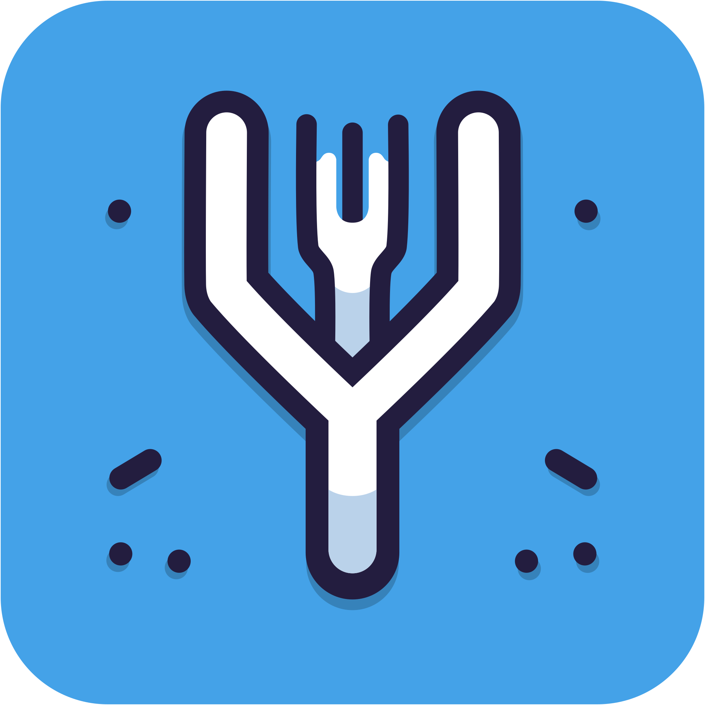

# Fork-Version

[](https://www.npmjs.com/package/fork-version)
[](https://github.com/eglavin/fork-version/actions/workflows/version.yml)
[](https://github.com/eglavin/fork-version/actions/workflows/release.yml)

<p align="center">
  
</p>

<p align="center">
Fork-Version automates version control tasks such as determining, updating, and committing versions, files, and changelogs, simplifying the versioning process when adhering to the <a href="https://www.conventionalcommits.org">conventional commit</a> standard.
</p>

<details>
<summary>This project is essentially a complete re-write of standard-version following on from its deprecation in May 2022.</summary>
Although there are many alternatives such as <a href=https://github.com/googleapis/release-please>release-please</a>. This project aims to continue focusing on just the versioning and changelog generation aspect of the process for use in other Git hosts outside of Github.
</details>

## What Does Fork-Version Do?

By following the [conventional commit](https://www.conventionalcommits.org) standard Fork-Version can automate the following tasks for you:

1. Determine the current and next version
1. Update the version in the selected files
1. Update your changelog
1. Commit the changed files
1. Create a tag for the new version

## Using Fork-Version

Primarily designed to be used without installation with `npx`, Fork-Version can also be installed globally or directly to the node package you're working on. The only software prerequisites you need are [git](https://git-scm.com) and [node](https://nodejs.org).

### Using `npx` (Recommended)

By using `npx` you can use Fork-Version without installation, on more then just a node project.

#### Basic usage

To use Fork-Version with `npx` you can use the following command:

```sh
npx fork-version
```

`npx` is recommended as you will always being the latest version, otherwise you can use a version tag to use a specific version `npx fork-version@[tag]`. Example:

```sh
npx fork-version@1.4.67
```

### Install Locally

To install the package locally to your project you can use one of the following commands:

| Package Manager | Install Command                       |
| --------------- | ------------------------------------- |
| npm             | `npm install fork-version --save-dev` |
| yarn            | `yarn add fork-version --dev`         |
| pnpm            | `pnpm add fork-version --save-dev`    |

You can then add the following entry to your package.json scripts section and use it like the other scripts you already use in your project.

```json
{
  "scripts": {
    "release": "fork-version"
  }
}
```

### Command Line Options

<!-- START COMMAND LINE OPTIONS -->

```txt
Usage:
  $ fork-version [options]

Commands:
  --help                Show this help message.
  --inspect-version     If set, fork-version will print the current version and exit.

Options:
  --file, -F            List of the files to be updated. [Default: ["bower.json", "manifest.json", "npm-shrinkwrap.json", "package-lock.json", "package.json"]]
  --glob, -G            Glob pattern to match files to be updated.
  --path, -P            The path fork-version will run from. [Default: process.cwd()]
  --changelog           Name of the changelog file. [Default: "CHANGELOG.md"]
  --header              The header text for the changelog.
  --tag-prefix          Specify a prefix for the created tag. [Default: "v"]
  --pre-release-tag     Make a pre-release with optional label if given value is a string.
  --current-version     If set, fork-version will use this version instead of trying to determine one.
  --next-version        If set, fork-version will attempt to update to this version, instead of incrementing using "conventional-commit".

Flags:
  --commit-all          Commit all staged changes, not just files updated by fork-version.
  --debug               Output debug information.
  --dry-run             No output will be written to disk or committed.
  --silent              Run without logging to the terminal.
  --git-tag-fallback    If unable to find a version in the given files, fallback and attempt to use the latest git tag. [Default: true]
  --sign                If true, git will sign the commit with the systems GPG key.
  --verify              If true, git will run user defined git hooks before committing.
```

<!-- END COMMAND LINE OPTIONS -->
